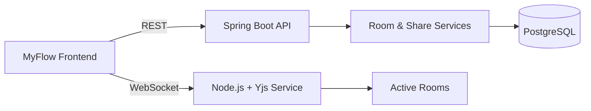

# MyFlow Backend

<p align="center">
  
</p>

<p align="center">
  <strong>Backend services for room management, snapshot sharing, and real-time collaborative whiteboard synchronization.</strong>
</p>

MyFlow separates normal application APIs from real-time collaboration.

**Spring Boot** handles REST-based application workflows, while a **Node.js/Yjs WebSocket service** handles long-lived collaborative sessions and high-frequency document updates.

---

## High-Level Design



## Why Two Backend Paths?

REST APIs and collaborative updates have very different workloads.

### REST is used for

- creating and joining rooms
- validating users and participants
- assigning room roles
- issuing WebSocket credentials
- creating shared snapshots
- retrieving shared snapshots

### WebSockets are used for

- live document updates
- Yjs synchronization
- participant join/leave events
- live cursors and presence

This keeps high-frequency whiteboard traffic away from normal request/response APIs.

---

## Room Collaboration Flow

```text
Frontend
   ↓
Create / Join Room
   ↓
Spring Boot validation
   ↓
Participant identity + role
   ↓
WebSocket credentials
   ↓
Connect to realtime service
   ↓
Join active room
   ↓
Synchronize Yjs updates
```

The REST service establishes a trusted room session before the realtime connection is created.

WebSocket credentials carry the room and participant context required by the realtime service, so clients cannot simply claim arbitrary room membership after connecting.

---

## Realtime Collaboration

Each participant maintains its own `Y.Doc`.

The WebSocket service exchanges Yjs updates between clients so all replicas eventually converge to the same whiteboard document.

```text
Client A ─┐
          ├── WebSocket Room ── Yjs updates
Client B ─┘
```

Persistent whiteboard content and temporary collaboration data are kept conceptually separate.

```text
Persistent
├── shared snapshots
└── application metadata

Ephemeral
├── active connections
├── participant presence
├── live cursors
└── active room state
```

---

## Snapshot Sharing

Sharing a flow does not require opening a collaboration room.

The backend stores an immutable document snapshot and exposes it through a unique flow identifier.

```text
Editable Workspace
       ↓
   POST /share
       ↓
Stored Snapshot
       ↓
GET /share/{flowId}
       ↓
Read-only Viewer
```

The snapshot contains the serialized whiteboard document together with metadata such as its ID and expiry time.

Expired snapshots can be removed through scheduled cleanup so temporary shared documents do not remain indefinitely.

---

## Tech Stack

| Area | Technology |
|---|---|
| Application APIs | Spring Boot |
| Realtime service | Node.js |
| Collaboration | Yjs / CRDT |
| Realtime transport | WebSocket |
| Persistent storage | PostgreSQL |

---
